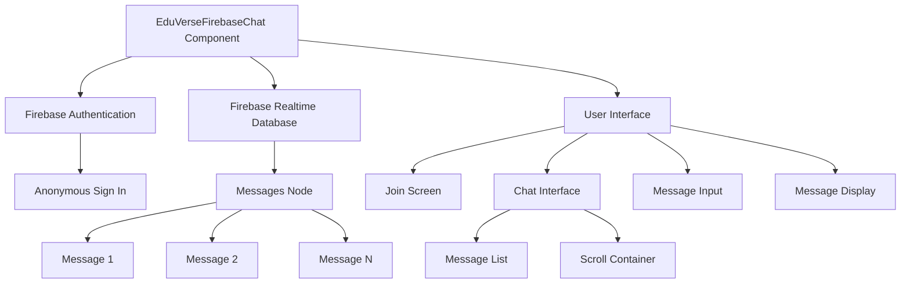
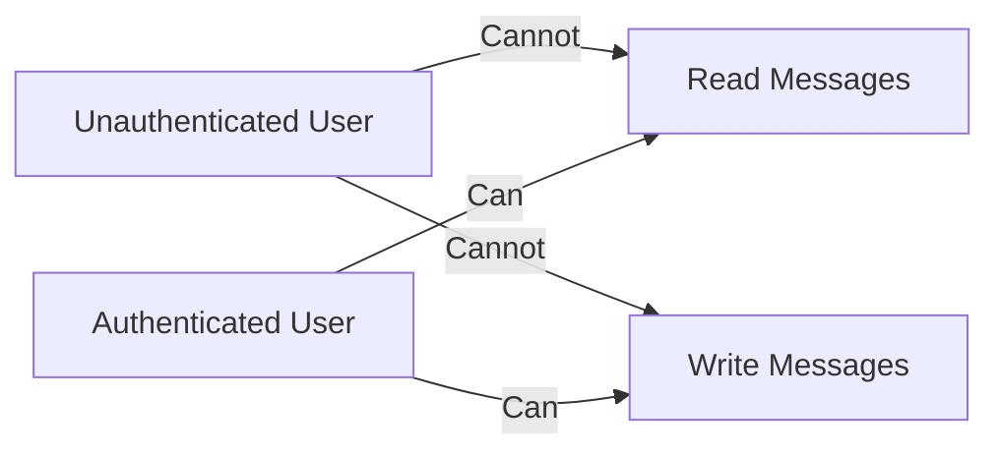
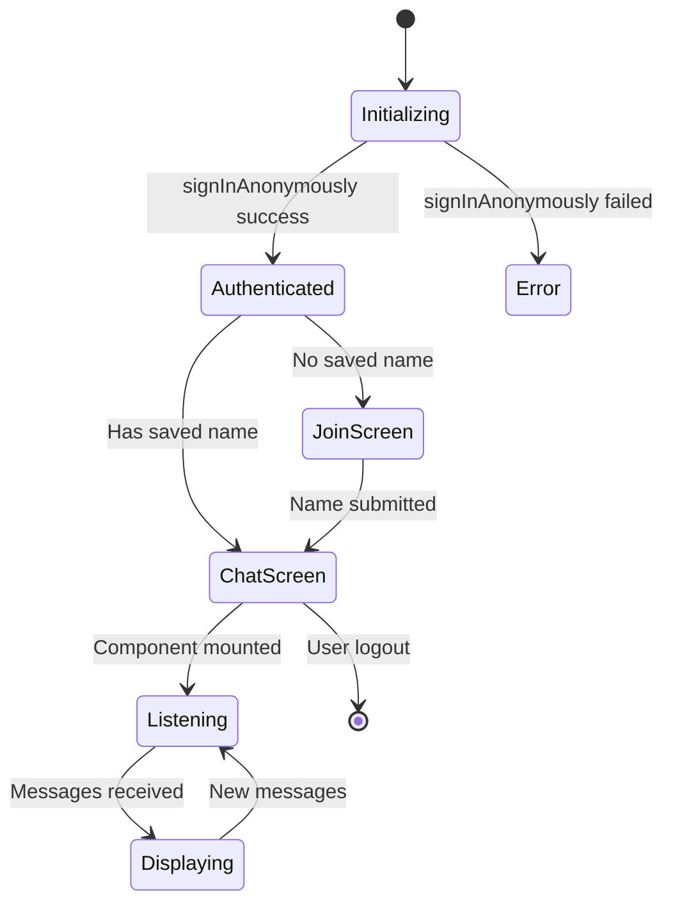

# Firebase Chat Architecture

## Component Diagram



## Data Flow

1. **User Authentication**
   ```mermaid
   sequenceDiagram
   EduVerseFirebaseChat->>Firebase Auth: signInAnonymously()
   Firebase Auth->>EduVerseFirebaseChat: User Credential
   EduVerseFirebaseChat->>localStorage: Save Display Name
   ```

2. **Message Sending**
   ```mermaid
   sequenceDiagram
   User->>EduVerseFirebaseChat: Type Message
   EduVerseFirebaseChat->>Firebase DB: push(message)
   Firebase DB->>All Clients: onValue trigger
   All Clients->>UI: Update Message List
   ```

3. **Message Receiving**
   ```mermaid
   sequenceDiagram
   Firebase DB->>EduVerseFirebaseChat: onValue(data)
   EduVerseFirebaseChat->>UI: Render Messages
   UI->>User: Display Messages
   ```

## Security Model



## State Management

